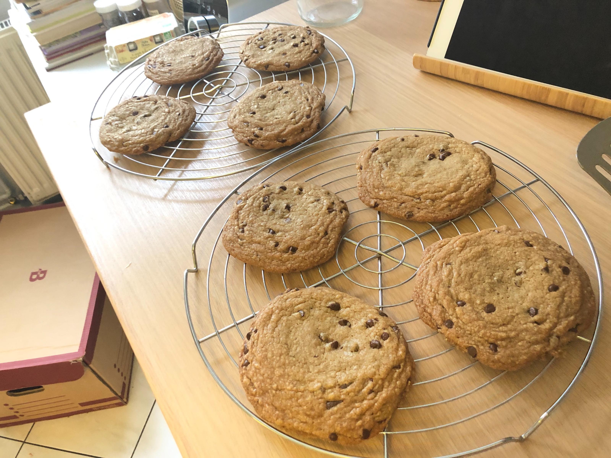

*Une recette pour avoir des beaux cookies croustillants à l’extérieur mais moelleux à l’intérieur, avec un bon goût caramélisé.*

Ingrédients :

- 210 g de beurre
- 100 g de sucre blanc et 150 g de sucre brun
- Sel
- Extrait de vanille
- 1 œuf entier + 1 jaune
- 250 g de farine + levure
- Pépites de chocolat (à discrétion)

Préchauffer le four à 190ºC.

Faire chauffer 150 g de beurre dans une casserole en inox, jusqu’à obtenir un beurre noisette. Transférer dans un saladier, et y mélanger le beurre restant.

Ajouter les deux sortes de sucre, le sel et l'extrait de vanille. Fouetter pour incorporer.

Ajouter l'œuf et le jaune et fouetter 30 secondes. Laisser reposer 3 minutes, puis fouetter à nouveau 30 secondes. Recommencer. Recommencer encore.

Incorporer la farine, mélanger, puis ajouter les pépites de chocolat.

Répartir 16 grosses boules de pâte sur deux plaques de cuisson en les gardant assez espacées.

Laisser cuire chaque plaque 10 à 14 minutes (ça va plus vite en chaleur tournante qu'en chaleur traditionnelle), en la retournant à la moitié du temps, jusqu’à ce que les cookies soient dorés et commencent à durcir sur les bords.

Laisser refroidir sur une grille avant de déguster.

Différences par rapport à la recette « standard » :

* Utiliser du beurre fondu, que dis-je, du beurre noisette
* Augmenter le ratio de sucre brun sur sucre blanc, pour ses propriétés hygroscopiques et pour le goût
* Augmenter le ratio jaune d’œuf sur blanc
* Battre la pâte en alternant 30 secondes de mélangeage et trois minutes de repos, pour bien dissoudre le sucre
* Faire des gros cookies, pour éviter qu’ils ne soient tous secs, et gardent un cœur moelleux

Sources : https://youtu.be/oCt3xhKCX1k et https://cooks.io/2SGteUU.
