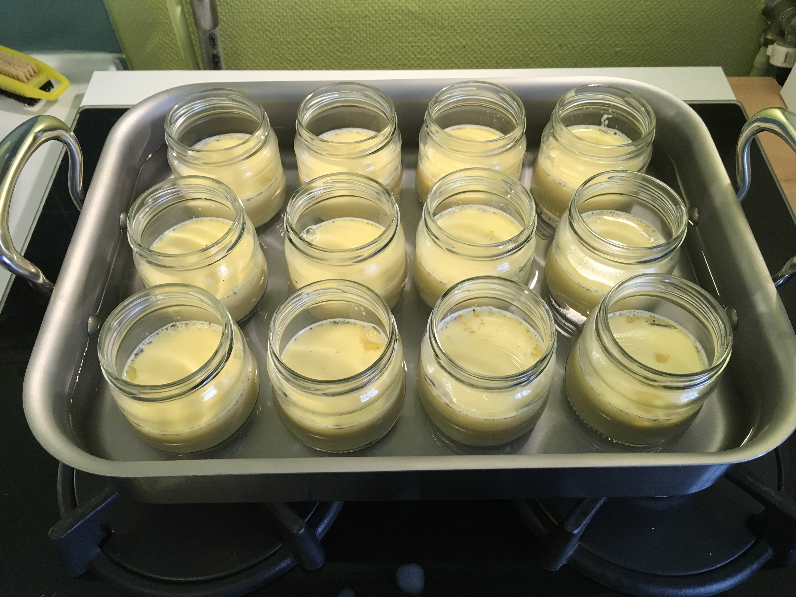

*J'ai pas mal itéré sur différents paramètres (proportions, durée de cuisson...) avant d'arriver à avoir un résultat qui me convienne. Voici la version actuelle (5.0) de ma recette. À suivre...*

Ingrédients :

- 1 litre de lait entier bio microfiltré (Monoprix)
- 2 gousses de vanille
- 8 œufs bio
- 175 g de sucre de canne brut bio

Je fais chauffer le lait avec la vanille.

Je mélange les œufs et le sucre, puis j’ajoute progressivement le lait vanillé en mélangeant.

Je répartis dans 12 ramequins pour qu’ils ne soient pas trop remplis.

Je les place dans un bain marie avec de l’eau chauffée à 65°C, et je mets à four chaud à 175°C pendant 40 minutes.

À 45 minutes la lame du couteau ressort propre mais je vérifie avec une cuillère et c’est encore liquide au fond.

Je prolonge jusqu’à 56-60 minutes. Ça a l’air bon. Je les sors et je les laisse refroidir à température ambiante. Plus tard je mets les couvercles et je les mets au frigo.

